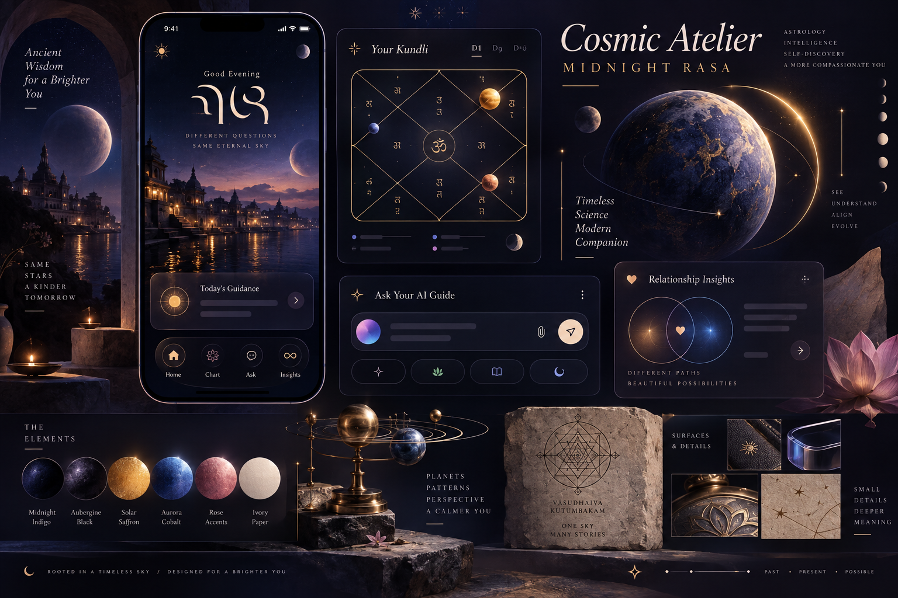
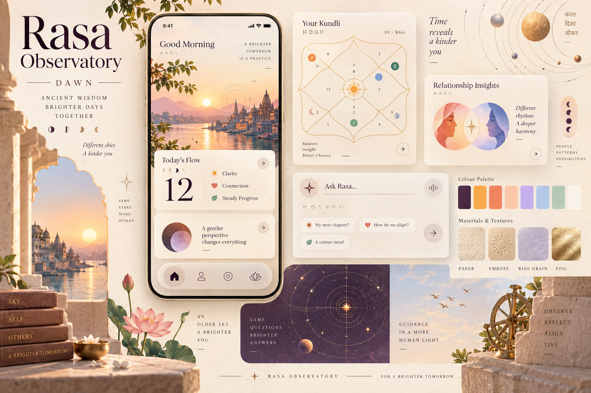
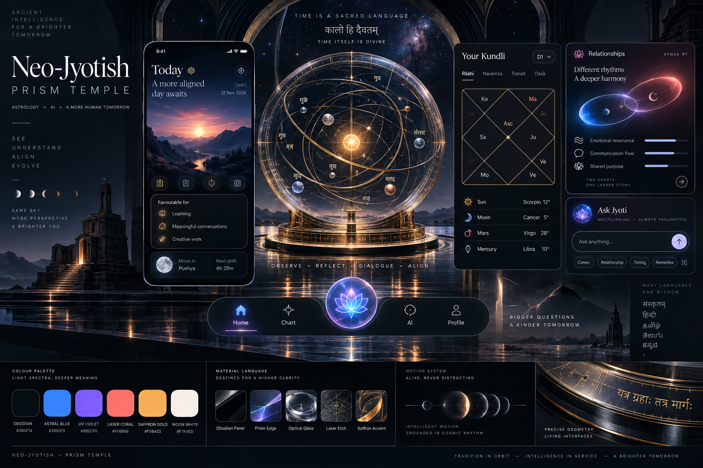

# AstroSaathi 3.0 — Cosmic Atelier Design North Star

**Action:** 1.1 — Approve the Cosmic Atelier design north star  
**Status:** Approved 8 September 2026  
**Created:** 8 September 2026  
**Type:** Design specification only  
**Implementation authorization:** None  
**Companion documents:** [Master redesign plan](./ASTROSAATHI_3_REDESIGN_PLAN.md), [current UI baseline](./ASTROSAATHI_CURRENT_UI_BASELINE.md), [frontend/backend contract map](./ASTROSAATHI_FRONTEND_BACKEND_CONTRACT_MAP.md)

---

## 1. Understanding lock

The approved discovery work establishes the following shared intent:

1. AstroSaathi is a multilingual Vedic astrology companion built around a user’s real Kundali—not a generic horoscope feed.
2. Its value comes from connecting daily timing, natal structure, AI conversation, reflection and relationships.
3. The redesign must feel premium, gradient-rich, playful and visually memorable at a September 2026 standard.
4. The experience must remain credible, calm and non-fear-based; it must not become a casino, occult novelty or astrologer marketplace.
5. Astrological calculations, Supabase contracts, authentication, persistence and business logic remain unchanged unless separately approved.
6. English, Hindi and Marathi, light/dark modes, reduced motion and mid-range mobile performance are first-class constraints.
7. The redesign proceeds one approved action at a time; Action 1.1 defines visual direction only.

The user’s approval of the master plan and instruction to begin Action 1.1 are treated as confirmation of this understanding lock.

### Assumptions

- Primary usage is mobile, with a meaningful desktop/web audience.
- Most users want simple guidance first and technical chart detail on demand.
- The product should feel emotionally warm and personal without pretending that AI is human or infallible.
- Dark mode may carry the most dramatic brand expression, but light mode must be equally intentional—not a washed-out translation.
- Premium quality should come from hierarchy, typography, composition and motion, not expensive real-time 3D everywhere.
- The existing brand mark can evolve later, but logo redesign is not part of this action.
- Generated moodboard typography and UI copy are illustrative only; generated words, glyphs and charts are not product content or calculation references.

### Non-functional defaults

- Target smooth interaction on mid-range mobile hardware; reserve GPU-heavy shaders for bounded decorative moments.
- No permanent animated canvas behind long-form text or data tables.
- Navigation and reading surfaces must remain usable when transparency and motion are reduced.
- Critical information must remain visible during partial network failure.
- User identity and sensitive chart content must never appear before authentication is resolved.
- Visual assets should have clear ownership, compression and fallback strategies.
- The system must be maintainable as reusable semantic tokens and components rather than per-screen art direction.

---

## 2. September 2026 design signals applied deliberately

This direction uses current signals as ingredients, not as a trend collage.

- Figma’s Config 2026 direction emphasizes a more expressive canvas, shader effects, motion as a reusable system and human creative specificity. AstroSaathi should adopt richer material and motion vocabulary while keeping it tokenized and purposeful. [Figma Config 2026 recap](https://www.figma.com/blog/config-2026-recap/)
- Figma’s 2026 trend guidance highlights bold typography, cutout/tactile graphics and hand-drawn character. AstroSaathi should use editorial scale and human imperfections to counter generic AI polish. [Figma 2026 web design trends](https://www.figma.com/resource-library/web-design-trends/)
- Google’s Material 3 Expressive research frames colour, shape, size, motion and containment as tools for clearer hierarchy and delight. AstroSaathi should enlarge truly important actions and let shapes respond to state instead of rounding everything equally. [Google expressive-design research](https://design.google/library/expressive-material-design-google-research)
- Apple’s current material guidance treats glass as a functional control/navigation layer, not a universal content treatment. AstroSaathi should use glass for floating navigation, context lenses and live controls while keeping reading/data surfaces solid. [Apple materials guidance](https://developer.apple.com/design/human-interface-guidelines/materials)
- Accessibility remains the floor: sufficient text contrast in both appearances, multiple cues beyond colour, adaptable motion/transparency and at least 44-point touch targets. [Apple accessibility guidance](https://developer.apple.com/design/human-interface-guidelines/accessibility), [W3C contrast technique](https://www.w3.org/WAI/WCAG21/Techniques/general/G18)

### Trend filter

Adopt:

- Expressive variable typography.
- Semantic aurora/shader gradients.
- Tactile grain and visibly human annotation.
- Sculptural 3D used as orientation and reward.
- Fluid shape/motion response for important controls.
- Thick, legible glass for navigation and transient context.
- Editorial asymmetry with disciplined alignment.

Reject:

- Glass on every card.
- Neon gradients without meaning.
- AI-generated visual noise.
- Bento grids that fragment a story into equal tiles.
- Perpetual parallax or floating planets behind reading content.
- Tiny technical labels used only to appear futuristic.
- Generic Western zodiac symbols as the primary cultural language.

---

## 3. Shared moodboard comparison criteria

Each direction is judged against the same product needs:

1. Distinctive AstroSaathi identity.
2. Premium impression without visual intimidation.
3. Playfulness without childishness.
4. Vedic authenticity without decorative appropriation.
5. Clarity for dense charts, tables and long interpretations.
6. Natural light and dark appearances.
7. Hindi/Marathi typographic resilience.
8. AI presence that feels alive but remains transparent.
9. Accessibility and mid-range-device feasibility.
10. Ability to scale across all 27 route screens.

---

## 4. Direction A — Cosmic Atelier: Midnight Rasa



### Central idea

**“Ancient sky, living intelligence.”**

The app feels like a private celestial atelier: the user’s chart is a living object, daily timing appears as changing light and AI guidance feels like a thoughtful lens placed over real astrological evidence.

### Visual character

- 70% cinematic celestial luxury.
- 20% tactile/playful interaction.
- 10% ceremonial Indian astronomical detail.
- Deep, immersive backgrounds with one controlled light source.
- Warm ivory reading surfaces and saffron actions prevent cold sci-fi distance.
- Sculptural planets and orbit paths create signature moments without occupying every screen.

### Colour principle

Indicative palette only; production OKLCH tokens belong to Action 1.5.

| Role | Directional colour |
|---|---|
| Foundation | Obsidian aubergine `#090713` |
| Depth | Midnight indigo `#15143A` |
| Intelligence | Aurora cobalt `#4B63FF` |
| Exploration | Ultraviolet `#8E61FF` |
| Revelation/action | Solar saffron `#F3A51C` |
| Human warmth | Aurora rose `#EE6F9E` |
| Reading | Moon ivory `#FFF6E8` |
| Secondary text | Mist lavender `#C9C6E7` |

### Typography principle

- A high-contrast, slightly soft variable serif for emotional headlines and interpretations.
- A highly legible contemporary sans for controls, chat and long reading.
- Dedicated Devanagari display and interface companions chosen by optical compatibility, not mere fallback availability.
- Large editorial numerals for dates, houses, degrees and scores.
- Tabular numerals for charts/tables; never sacrifice alignment for drama.
- Hand annotations are vector marks and short accents, not a third body-copy font.

### Illustration principle

- Translucent sculptural planets, orreries and orbital light.
- Constellations derived from the user’s chart only when data meaning is retained.
- Lotus, yantra and observatory geometry abstracted into frames, masks and transitions.
- Human scenes are rare; the user’s data—not stock photography—is the protagonist.

### Material principle

- **Atmosphere layer:** deep gradient field, subtle grain, one aurora light source.
- **Content layer:** opaque/near-opaque surfaces for charts, tables and interpretations.
- **Control layer:** thick luminous glass for navigation, context lenses, composer and transient overlays.
- **Live layer:** restrained prismatic edge for AI streaming, active transit or current-time focus.
- Gold is an emissive state/accent, not a metallic border around everything.

### Motion principle

- Chart reveal: geometry draws/unfolds once, then rests.
- Context change: subject/date lens morphs and the content crossfades spatially.
- AI activity: a slow bounded aurora breath around the composer or provenance chip.
- Daily arrival: 1–2 second orbital alignment used only for a meaningful new-day moment.
- Tap feedback: spring compression and localized light response.
- Reduced motion: opacity/colour state changes with no spatial travel.

### How it expresses the product worlds

| World | Signature expression |
|---|---|
| Today | One solar/lunar atmosphere that changes with the day’s dominant story |
| My Cosmos | Chart as a precious instrument; technical detail on warm solid panels |
| Ask | Aurora intelligence with visible source/provenance chips |
| Journey | Time as an orbital path with paper-like memories anchored to it |
| Connections | Two coloured orbital identities creating a shared third field |

### Strengths

- Most ownable and premium.
- Extends the strongest part of the current product: the dark celestial entry experience.
- Makes gradients meaningful through time, AI and relationships.
- Gives AstroSaathi a recognizable visual signature across marketing and product.
- Strong foundation for ceremonial delight without changing core UX behavior.

### Risks

- Can become visually heavy if every surface is dark or glowing.
- Requires disciplined contrast and solid reading surfaces.
- Sculptural assets must be lightweight and reusable.
- Cheap implementation would quickly look like gaming, crypto or generic mysticism.

---

## 5. Direction B — Rasa Observatory: Dawn



### Central idea

**“Ancient wisdom in a kinder daylight.”**

AstroSaathi becomes a contemporary Indian observatory and reflective journal. It feels sunlit, tactile and human—closer to premium publishing and wellbeing than cinematic technology.

### Visual character

- 55% warm editorial premium.
- 30% tactile/playful humanity.
- 15% astronomical heritage.
- Soft sunrise gradients, paper textures, embossed geometry and clay-like celestial forms.
- Less spectacle; more intimacy and daily approachability.

### Colour principle

| Role | Directional colour |
|---|---|
| Foundation | Luminous ivory `#FFF9EE` |
| Material | Warm parchment `#F4E6D4` |
| Primary ink | Deep plum `#2A112D` |
| Revelation/action | Saffron `#F2A51A` |
| Human energy | Coral `#F27660` |
| Reflection | Powder lavender `#B9A7F8` |
| Clarity | Soft sky `#9DC9F6` |
| Growth | Muted leaf `#6F9C7D` |

### Typography principle

- Larger editorial serif headlines with generous line height.
- Humanist sans for interface and conversational text.
- Devanagari can become a visible design asset through balanced scale and spacing.
- Oversized dates/numerals function like almanac typography.

### Illustration and material principle

- Riso grain, embossed sun/moon marks, line-drawn orbits and restrained botanical/lotus forms.
- Solid paper cards dominate; pearlescent or frosted controls float above them.
- Warm shadows are shallow and broad.
- Illustration feels handmade, but chart geometry remains exact.

### Motion principle

- Page turns, soft sunrise wipes and stamped/pressed state feedback.
- Gentle constellation drawing and paper-layer shifts.
- No bouncy cartoon physics.
- Reduced-motion mode retains clear selection through colour, border and type weight.

### Strengths

- Warmest and most broadly approachable.
- Excellent for long-form reading, journaling and daylight use.
- Makes Indian editorial/astronomical influence feel contemporary rather than ornamental.
- Lower rendering cost and easier accessibility than the other options.

### Risks

- Can drift into generic beige wellness or boutique editorial design.
- Less immediate “wow” for AI chat and technical chart capabilities.
- Needs a strong dark-mode translation to remain celestial.
- Handcrafted motifs can become nostalgic or decorative if overused.

---

## 6. Direction C — Neo-Jyotish: Prism Temple



### Central idea

**“The Kundali as a precision instrument.”**

AstroSaathi becomes a futuristic observatory where Jyotish geometry, AI and time-based data operate as one high-precision system.

### Visual character

- 65% avant-garde technology.
- 25% scientific/technical precision.
- 10% ceremonial astronomical geometry.
- Obsidian panels, spectral light, optical instruments and precise data graphics.

### Colour principle

| Role | Directional colour |
|---|---|
| Foundation | Observatory black `#080B14` |
| Surface | Ink steel `#151A27` |
| Precision | Astral blue `#3B82F6` |
| Exploration | UV violet `#8B5CF6` |
| Relationship | Laser coral `#FF6B6B` |
| Revelation | Saffron gold `#FFB44B` |
| Reading | Moon white `#F7F4ED` |

### Typography principle

- Expressive variable grotesk for system hierarchy.
- One elegant serif reserved for interpretations and reflective content.
- Technical micro-labels and large numeric displays create observatory precision.
- Devanagari must remain optically equal rather than becoming decorative data texture.

### Illustration and material principle

- Optical glass, laser-etched geometry, prismatic edges and kinetic orreries.
- Opaque panels hold all dense information.
- Relationship states use two spectral fields rather than hearts or romantic clichés.
- AI presence is a responsive light instrument, not a character avatar.

### Motion principle

- Precision tracking, orbital alignment, measured morphing and light refraction.
- Strongest potential for data-driven motion.
- Requires strict motion budgets and static/reduced-transparency fallbacks.

### Strengths

- Most visually futuristic and technically credible.
- Excellent for charts, transits, markets and advanced users.
- Strong differentiation from conventional astrology apps.

### Risks

- Coldest and least emotionally safe.
- Highest risk of cyberpunk, crypto or gaming associations.
- Long readings, journaling and compassionate guidance could feel out of place.
- Highest performance and implementation complexity.
- Least forgiving for Hindi/Marathi text expansion and accessibility.

---

## 7. Comparative scorecard

Scores use a five-point scale and are directional design judgments, not user-research results.

| Criterion | A — Midnight Rasa | B — Dawn | C — Prism Temple |
|---|---:|---:|---:|
| Distinctive AstroSaathi identity | 5.0 | 4.2 | 4.5 |
| Premium impression | 5.0 | 4.4 | 4.8 |
| Playful without childishness | 4.5 | 4.7 | 3.8 |
| Trust and emotional safety | 4.5 | 5.0 | 3.4 |
| Dense-data readability | 4.4 | 4.8 | 4.1 |
| Light/dark system potential | 4.8 | 4.3 | 3.4 |
| Multilingual resilience | 4.5 | 4.8 | 3.6 |
| Accessibility/performance feasibility | 4.2 | 4.8 | 3.0 |
| AI/voice expression | 4.9 | 4.0 | 5.0 |
| Whole-product scalability | 4.8 | 4.5 | 3.6 |
| **Weighted conclusion** | **4.7** | **4.5** | **3.9** |

---

## 8. Recommended north star

### Recommendation

Approve **Direction A — Cosmic Atelier: Midnight Rasa** as the core brand system, with two controlled borrowings:

1. Use **Direction B’s paper warmth and editorial breathing room** to define Dawn/light mode and all long-form reflection surfaces.
2. Use **Direction C’s precision-instrument language** only inside advanced chart, transit, market and provenance details.

This is not an equal three-way blend. The hierarchy is:

```text
Midnight Rasa identity      70%
Dawn readability/humanity   20%
Prism precision              10%
```

The result remains one coherent system:

> **AstroSaathi is a living Vedic cosmos—cinematic at first glance, calm when reading, playful when exploring and precise when evidence matters.**

### Why this is the best fit

- It evolves the strongest existing visual equity rather than discarding it.
- It can deliver the user’s desired premium gradient “Dribbble” impact without applying spectacle to every screen.
- It naturally encodes Today, AI, time and relationships through light/orbit semantics.
- It allows a genuinely warm light theme instead of forcing dark glass into daytime.
- It keeps technical astrology credible through opaque data surfaces and limited precision motifs.
- It is ambitious but can be implemented progressively with CSS, SVG and a small asset system.

---

## 9. Final design principles if Direction A is approved

### Principle 1 — The user’s chart is the hero

Decorative planets and gradients may frame the experience, but personalized data and its meaning own the focal point.

### Principle 2 — One atmospheric event per screen

Each screen receives one dominant visual gesture: a solar arc, lunar pool, relationship field, time orbit or AI aurora. Everything else supports it.

### Principle 3 — Solid for truth, glass for control

- Astrological facts, calculations, interpretations and long text live on solid high-contrast surfaces.
- Navigation, context switches, transient overlays and live controls may use thick glass.
- Glass never becomes the default card material.

### Principle 4 — Gradients carry meaning

| Gradient family | Meaning |
|---|---|
| Solar | action, clarity, revealed insight |
| Lunar | reflection, emotional tone, journaling |
| Aurora | AI activity, personalization, live generation |
| Relationship | two subjects and their shared field |
| Time | past, present and possible future |

### Principle 5 — Play through response, not decoration

Playfulness comes from spring response, shape change, reveal, tactile soundless feedback and tiny celestial surprises—not random stickers or floating emojis.

### Principle 6 — Ceremony is earned

Longer animation and sculptural imagery appear only for meaningful milestones: chart creation, a new daily reading, saved reflection patterns or a relationship comparison reveal.

### Principle 7 — Technical depth unfolds progressively

Every advanced module starts with meaning, then evidence, then methodology. Expert detail remains available without dominating the first view.

### Principle 8 — Indian astronomical influence is structural

Use geometry, almanac rhythm, language and observatory references in grids, motion and framing. Avoid generic zodiac wallpaper and superficial temple decoration.

### Principle 9 — AI must remain visibly grounded

AI states use Aurora styling plus clear chart/time/person provenance. A beautiful answer never hides whether it came from stored data, calculated evidence or generated interpretation.

### Principle 10 — Accessibility is part of premium craft

Contrast, focus, reduced motion/transparency, text enlargement, touch size and multilingual fit are acceptance gates, not later cleanup.

---

## 10. Typography system direction

Exact font selection, licensing, loading and token values belong to Action 1.5. The approved principle should be:

| Layer | Character | Use |
|---|---|---|
| Display | Expressive variable serif, warm and slightly unconventional | Hero insight, world title, reflective quote |
| Interface | Neutral-humanist variable sans | Navigation, controls, chat and long copy |
| Devanagari display | Serif or expressive variable face optically paired to the Latin display | Hindi/Marathi hero and section titles |
| Devanagari interface | Highly legible sans with complete conjunct support | Hindi/Marathi controls and reading |
| Numeric | Lining/tabular styles from the interface family | Houses, degrees, dates, scores, periods |
| Annotation | Custom vector marks, not body text | Orbits, emphasis, “handmade” detail |

Candidate evaluation later should include Fraunces/Newsreader-class Latin display character, Noto Serif Devanagari-class coverage and DM Sans/Manrope-class UI clarity. No font is approved by this comparison alone.

---

## 11. Motion system direction

| Motion tier | Duration | Use | Never use for |
|---|---:|---|---|
| Micro response | 140–220 ms | press, selection, chip, icon feedback | page travel |
| Component morph | 220–360 ms | context lens, disclosure, active card | long reading entrance |
| Spatial transition | 320–500 ms | world change, sheet, subject switch | every scroll event |
| Ceremonial | 1.2–2.5 s | first chart, new day, earned reveal | repeated navigation |
| Ambient bounded | ≤6 s loop, then rest | AI working or one hero moment | backgrounds behind content |

Motion must answer at least one question: Where did this come from? What changed? What should I notice? Did my action succeed? If it answers none, remove it.

---

## 12. Asset and performance strategy

- Prefer CSS gradients, SVG geometry and compressed still textures.
- Use a very small set of reusable sculptural planet renders rather than unique 3D scenes per route.
- Lazy-load ceremonial imagery below or after critical content.
- Provide static poster/fallback states for every shader or animated object.
- Avoid real-time WebGL as a baseline dependency; consider it only for a later isolated signature moment with measured benefit.
- Keep text out of raster imagery.
- Keep kundli/chart diagrams data-driven and accessible; moodboard charts are decorative examples only.

---

## 13. Directional acceptance tests

A future screen belongs to Cosmic Atelier only if it passes all of these:

- The primary insight is understandable before decoration is noticed.
- The screen has no more than one dominant atmospheric effect.
- Long text and dense data sit on solid legible surfaces.
- Glass is limited to controls/navigation/transient overlays.
- Gradient choice has a documented semantic reason.
- Playfulness appears through interaction or one meaningful detail.
- Light mode feels intentionally “Dawn,” not merely inverted dark mode.
- Hindi and Marathi maintain equal hierarchy and do not become visually secondary.
- Reduced-motion and reduced-transparency versions retain clear state.
- The screen cannot be mistaken for a crypto, gaming, generic AI or Western horoscope product.

---

## 14. Decision log

| Decision | Alternatives considered | Reason |
|---|---|---|
| Keep “Cosmic Atelier” as the umbrella concept | Generic celestial minimalism; full futuristic observatory | It connects premium atmosphere, craft, intelligence and personal interpretation. |
| Recommend Midnight Rasa as the dominant identity | Dawn-first; Prism-first | It is the most distinctive, extends current equity and best expresses AI plus astrology. |
| Define light mode from Dawn rather than invert Midnight | One palette algorithmically inverted | Long-form readability and daylight warmth require their own art direction. |
| Borrow Prism language only for advanced evidence | Apply futuristic styling everywhere | Precision helps technical screens but harms emotional safety when dominant. |
| Limit glass to the functional layer | Glass cards throughout | Preserves hierarchy, legibility, performance and 2026 material guidance. |
| Make gradients semantic | Decorative gradients per card | Meaning creates consistency and prevents visual fatigue. |
| Use structural Indian astronomical references | Generic zodiac or overt temple ornament | Feels authentic to Jyotish while remaining modern and respectful. |
| Keep AI visibly grounded in provenance | Magical oracle avatar | Supports trust and the existing contract-preservation principles. |
| Treat generated boards as inspiration only | Use generated UI/charts literally | Generated copy/glyphs/charts are not reliable product specifications. |

---

## 15. Approval record

The user approved the recommended system on 8 September 2026:

- **70% Cosmic Atelier: Midnight Rasa**.
- **20% Rasa Observatory: Dawn warmth and readability**.
- **10% Neo-Jyotish: Prism precision**.

Action 1.1 is complete. The approval authorizes subsequent design-specification actions one at a time; it does not authorize application implementation.
