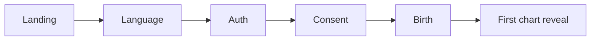

# AstroSaathi 3.0 — Future Information Architecture

**Action:** 1.2 — Approve the future information architecture  
**Status:** Approved 8 September 2026  
**Created:** 8 September 2026  
**Type:** UX specification only  
**Implementation authorization:** None  
**Approved visual direction:** 70% Midnight Rasa + 20% Dawn warmth/readability + 10% Prism precision  
**Companion documents:** [Master redesign plan](./ASTROSAATHI_3_REDESIGN_PLAN.md), [design north star](./ASTROSAATHI_COSMIC_ATELIER_NORTH_STAR.md), [current UI baseline](./ASTROSAATHI_CURRENT_UI_BASELINE.md), [backend contract map](./ASTROSAATHI_FRONTEND_BACKEND_CONTRACT_MAP.md)

---

## 1. Purpose and boundary

This document reorganizes the complete current AstroSaathi product into a comprehensible future structure. It defines navigation, screen ownership, discovery paths, legacy-route preservation and responsive shell behavior.

This action does **not**:

- Change routes, redirect behavior or authentication.
- Implement a navigation component or new screen.
- Move, combine or delete backend queries.
- Define Subject lens, Time lens or Ask-from-anywhere state behavior; those belong to Action 1.3.
- Rewrite content or ethical-language rules; those belong to Action 1.4.
- Approve new calculations, predictions or data models.

---

## 2. Understanding summary

1. The current application has strong functional depth but distributes it across a three-item shell, floating chat, Home shortcuts and Settings links.
2. Users should think in life questions—not route names, backend services or calculation categories.
3. Five persistent product worlds will organize every existing capability: **Today, My Cosmos, Ask, Journey and Connections**.
4. Settings becomes a utility destination accessed from the profile/celestial avatar, not a primary world.
5. Every current screen and data contract must retain a canonical home, with no orphaned feature or broken deep link.
6. The primary navigation must work at 320 px, in English/Hindi/Marathi, by keyboard and with screen readers.
7. The new structure must support future global context without defining or implementing that context in this action.

### Assumptions

- Returning users derive the most recurring value from Today and Ask.
- My Cosmos is the canonical home for identity and technical natal analysis.
- Journey owns autobiographical time: life events, journal and saved guidance history.
- Connections owns people and relationship interpretation.
- Market astrology remains available but clearly separated from personal wellbeing guidance.
- Existing URLs remain valid indefinitely through stable routes or redirects.
- One capability has one canonical owner even when summaries or deep links appear elsewhere.
- Navigation state can be remembered locally during a session; no new database persistence is assumed.

### Non-functional requirements

- **Performance:** navigation chrome renders before non-critical world content; decorative assets cannot block route readiness.
- **Scale:** the hierarchy must handle more reports, saved people and conversations without adding primary navigation items.
- **Security/privacy:** protected content cannot render before auth resolution; people and relationship context must remain explicit.
- **Reliability:** each world supports independent loading/partial failure without collapsing the whole shell.
- **Maintenance:** route ownership and navigation definitions must come from a single typed configuration when implemented.
- **Localization:** primary labels use short localized forms plus accessible full names where necessary.

---

## 3. IA approaches considered

### Approach A — Five persistent worlds — recommended

Five stable destinations organize the complete product. Ask receives central visual emphasis on mobile but remains one equal semantic destination.

**Advantages**

- Matches users’ recurring questions.
- Every current capability has a clear owner.
- Scales without placing Settings in primary navigation.
- Keeps chat visible and makes Journey/Connections discoverable.
- Supports future Subject and Time context consistently.

**Trade-offs**

- Five mobile items require very short labels and careful 320 px testing.
- My Cosmos contains substantial depth and needs a strong secondary hierarchy.
- Requires a new Journey overview or a composed landing state.

### Approach B — Three-task shell

Use Today, Ask and Explore as primary destinations; place Cosmos, Journey and Connections within Explore.

**Advantages:** simplest mobile bar, low navigation density, easier localization.  
**Trade-offs:** repeats the current discoverability problem, makes high-value worlds feel secondary and turns Explore into another feature drawer.

### Approach C — Spatial orbit navigation

Use a visual cosmos with orbiting destinations and adaptive gestures.

**Advantages:** highly memorable, dramatic and brand-ownable.  
**Trade-offs:** weaker accessibility, slower expert navigation, high implementation risk, difficult localization and poor fit for data-heavy daily use.

### Decision

Use **Approach A: five persistent worlds**. Borrow spatial/orbital expression for transitions and visual grouping, never as the only navigation mechanism.

---

## 4. Top-level sitemap

```mermaid
flowchart TD
    Entry[Public entry] --> Landing[Landing]
    Entry --> Language[Language]
    Entry --> Auth[Sign in / Sign up / Recovery]
    Entry --> Legal[Privacy / Terms]

    Auth --> Consent[Consent]
    Consent --> Birth[Birth details]
    Birth --> Reveal[First chart reveal]
    Reveal --> App[Authenticated app shell]

    App --> Today[Today]
    App --> Cosmos[My Cosmos]
    App --> Ask[Ask]
    App --> Journey[Journey]
    App --> Connections[Connections]
    App --> Profile[Profile and Settings]

    Today --> Daily[Daily pulse]
    Today --> Panchang[Panchang]
    Today --> Horoscope[Daily horoscope]
    Today --> Transits[Transits]
    Today --> Guidance[Guidance inbox]
    Today --> Markets[Market timing]

    Cosmos --> Identity[Cosmic identity]
    Cosmos --> Kundali[Kundali and Vargas]
    Cosmos --> Dashas[Dashas and timing]
    Cosmos --> Patterns[Doshas and patterns]
    Cosmos --> Remedies[Remedies]
    Cosmos --> Strength[Ashtakavarga]
    Cosmos --> Other[Other lenses: Numerology and Lo Shu]

    Ask --> NewAsk[New conversation]
    Ask --> History[Conversation history]
    Ask --> Voice[Voice interaction]
    Ask --> Evidence[Chart/time/person evidence]

    Journey --> Chapter[Current chapter]
    Journey --> Timeline[Life timeline]
    Journey --> Journal[Reflection journal]
    Journey --> SavedGuidance[Saved guidance]

    Connections --> People[People]
    Connections --> Person[Person cosmos]
    Connections --> Compatibility[Compatibility]
    Connections --> RelationshipAsk[Ask about this connection]

    Profile --> BirthSettings[Birth profile]
    Profile --> Preferences[Language / Theme / Tone / Length]
    Profile --> Memory[AI memory]
    Profile --> Proactive[Proactive guidance]
    Profile --> VoiceSettings[Voice settings]
    Profile --> Delivery[WhatsApp delivery]
    Profile --> Governance[Privacy / Terms / Account]
```



---

## 5. The five product worlds

## 5.1 Today

**User question:** “What matters to me now?”  
**Primary role:** recurring daily entry point.  
**Visual atmosphere:** the current sky translated into one Solar/Lunar daily field.

### Hierarchy

1. **Daily pulse:** one clear synthesized headline using existing available outputs; it must not fabricate synthesis when sources fail.
2. **Why today:** dominant transit/timing evidence and confidence/provenance.
3. **Do or reflect:** mantra, practical guidance and Ask shortcut.
4. **Explore today:** Panchang, full horoscope and transit detail.
5. **Guidance inbox:** proactive nudges, unread/read state and delivery preferences link.
6. **Market timing:** explicitly separated specialist destination with existing disclaimers.

### Canonical ownership

- Daily mantra.
- Transit highlight and planet transits.
- Panchang.
- Daily horoscope.
- Proactive nudge inbox.
- Financial barometer, Bradley and SBC market material.

### Cross-links

- A transit can open its natal evidence in My Cosmos.
- Any guidance can open Ask with source context later defined in Action 1.3.
- A relevant moment can be saved/reflected on in Journey.

### Boundary

Today does not own natal identity, long-term life history or relationship records. It may summarize them only when they explain the current day.

---

## 5.2 My Cosmos

**User question:** “Who am I astrologically, and what patterns shape me?”  
**Primary role:** personal natal reference and technical depth.  
**Visual atmosphere:** a precious observatory instrument on solid, readable evidence surfaces.

### Secondary hierarchy

1. **Overview — Cosmic identity:** Sun, Moon, Ascendant, Nakshatra and a chart-status summary.
2. **Kundali:** Rashi chart, Vargas, planets and houses.
3. **Timing:** Vimshottari Dasha hierarchy and timeline.
4. **Patterns:** Mangal, Kaal Sarp, Sade Sati and other currently supported dosha reports.
5. **Remedies:** current remedy and mantra outputs with safety language.
6. **Strength:** Ashtakavarga.
7. **Other lenses:** Numerology and Lo Shu, clearly labeled as separate interpretive systems.

### Why this is better than seven peer tabs

- Identity/overview gives beginners an understandable first stop.
- Kundali and Timing are primary evidence systems.
- Patterns/Remedies become a connected question-and-response sequence.
- Ashtakavarga remains available for advanced users without competing with the first view.
- Numerology and Lo Shu remain accessible but do not appear equivalent to Vedic chart computation.

### Canonical ownership

- Birth chart and all Vargas.
- Planets, signs, houses, nakshatras and related tables.
- Dashas.
- Doshas and Sade Sati.
- Remedies tied to the personal chart.
- Ashtakavarga.
- Numerology and Lo Shu.
- Birth-data edit entry point, while the form itself remains a protected profile operation.

### Boundary

My Cosmos is always the signed-in user’s chart unless the Subject lens explicitly changes later. Saved people remain owned by Connections.

---

## 5.3 Ask

**User question:** “What does this mean for me?”  
**Primary role:** conversational interpretation of existing chart, time and relationship evidence.  
**Visual atmosphere:** Aurora intelligence with visible provenance.

### Hierarchy

1. **New Ask:** contextual greeting, suggested questions and composer.
2. **Conversation:** streaming response, evidence/provenance, follow-up suggestions and feedback.
3. **History:** searchable/grouped conversation list when later supported by existing client-side capability; no new server search is assumed here.
4. **Voice:** input and read-aloud as modes of the same conversation.
5. **Conversation controls:** new, rename, delete and subject context where currently supported.

### Shell decision

Ask no longer feels like a separate product. It may use an expanded focused layout, but the user must retain orientation to the five-world shell:

- Desktop: persistent/collapsible global rail plus chat-history panel.
- Mobile: world navigation may minimize while the keyboard/composer is active, but it returns predictably and is not replaced by an unrelated chat shell.

### Boundary

Ask interprets; it does not silently become the source of chart facts. The UI must distinguish calculated evidence, stored context, AI inference and user reflection.

---

## 5.4 Journey

**User question:** “How is my life unfolding?”  
**Primary role:** one reflective history joining life events, journal entries and saved guidance.  
**Visual atmosphere:** Lunar paper memories arranged along an orbital time path.

### Hierarchy

1. **Current chapter:** current Dasha/time context summarized from existing data.
2. **Timeline:** life events grouped by year with stamped astrological context.
3. **Journal:** reflections grouped by month, with mood and tag cues.
4. **Guidance history:** proactive nudges or saved guidance already available to the user.

### Hub behavior

Journey needs a real overview rather than a menu of links. The overview may compose small read-only summaries from existing queries:

- Current period.
- Recent life event.
- Recent journal entry.
- Unread/recent guidance.

If a source fails, its module fails independently. No new “life pattern” claim may be generated merely to fill the hub.

### Canonical ownership

- Life Timeline.
- Life-event create/edit/delete.
- Reflection Journal.
- Journal create/edit/delete.
- Stored astrological context attached to those records.
- Historical/saved proactive guidance view.

### Boundary

Journey owns personal history, not today’s active inbox or natal technical reports. It may link to the relevant Today or My Cosmos evidence.

---

## 5.5 Connections

**User question:** “How do our charts interact?”  
**Primary role:** people, relationship context and compatibility.  
**Visual atmosphere:** two subject colours forming a shared Relationship field.

### Hierarchy

1. **People:** the user plus saved people, relationship type and add action.
2. **Person cosmos:** selected person’s basic placements, chart/Varga and Ask action.
3. **Compatibility overview:** relationship patterns before the score.
4. **Evidence:** Guna Milan, Mangal comparison and synastry details.
5. **Relationship Ask:** conversation entry with both identities explicit.

### Canonical ownership

- Related-chart list and limit state.
- Add/edit/delete person.
- Person chart and Vargas.
- Compatibility bundle.
- Guna Milan, Mangal comparison and synastry.

### Boundary

- “Myself” is an anchor back to My Cosmos, not a duplicate stored person.
- Compatibility must never open without clearly naming both subjects.
- Connections does not own general account/contact settings.

---

## 6. Profile and Settings placement

Settings is removed from primary navigation but remains fully reachable.

### Entry

- A celestial avatar/profile control sits at the bottom of the desktop rail and the top trailing edge of the mobile/tablet shell.
- The control includes an accessible “Profile and settings” name; the glyph/initial is decorative context, not the only label.

### First interaction

- **Desktop:** compact profile popover with name/email, birth-details entry, Settings, language/theme quick controls and Sign out.
- **Mobile:** bottom sheet with the same high-frequency items.
- “Settings” opens the full settings route; destructive/account controls never appear in the lightweight popover/sheet.

### Full settings structure

1. **Your profile:** display identity and birth details.
2. **Experience:** language, appearance, tone and answer length.
3. **AI and memory:** opt-in, topic memory, retention and emotional state.
4. **Guidance and delivery:** proactive frequency, quiet hours and WhatsApp.
5. **Voice:** transcription language, speaker and pace.
6. **Privacy and governance:** consent receipt where exposed, privacy, terms and account actions.

People, Journal and Life Timeline are removed from Settings because they now have canonical product worlds.

---

## 7. Navigation by form factor

## 7.1 Mobile: five-item celestial dock

```text
Today    Cosmos    Ask    Journey    Connections
  ○         ◇       ✦        ◌             ∞
```

### Rules

- Ask is centered and may receive a stronger shape/light treatment, but remains the same tap-target size and semantic level.
- Use short visible labels; the accessible name may contain the full localized world name.
- Icons cannot be the only persistent meaning.
- Minimum effective target is 44 × 44 px.
- Selected state uses shape, label weight and icon treatment—not colour alone.
- The dock uses thick glass over atmospheric content and an opaque/high-contrast fallback.
- At 320 px, labels may use approved short translations, never horizontal scrolling.
- Safe-area inset is applied once.
- When the keyboard opens in Ask or a form, the dock may yield to the task; its return behavior must be deterministic.

## 7.2 Tablet

- Compact vertical rail when width allows; otherwise the mobile dock.
- Labels can reveal on focus/hover/selection but remain available to assistive technology.
- Split views are allowed for Ask history, Journey timeline/detail and Connections list/detail.

## 7.3 Desktop: adaptive five-world rail

- Compact icon rail by default at medium widths.
- Expanded labeled rail at wider widths or through a user-controlled toggle.
- Brand at top; five worlds in the primary region; profile control anchored at bottom.
- The rail remains stable while a world’s secondary navigation changes.
- Ask can add a conversation-history panel beside the global rail; it cannot replace the global rail.
- Main content width adapts by content type:
  - reading: approximately 680–760 px;
  - standard dashboards: approximately 960–1120 px;
  - chart/table workbench: up to approximately 1280 px;
  - never stretch prose merely to fill the viewport.

## 7.4 Web/browser conventions

- Browser Back returns through actual navigation history.
- Every meaningful secondary view has a shareable/deep-linkable URL or search state.
- Cmd/Ctrl-click and open-in-new-tab work for navigation links.
- Focus moves to the new page heading after major route changes when appropriate.
- Skip link targets the main content beyond the rail.

---

## 8. World landing-page anatomy

Every world follows the same high-level order without becoming a repeated dashboard template:

1. **Orientation:** world title, subject identity and optional time location.
2. **Primary story:** the one thing the user came to understand or do.
3. **Evidence/actions:** relevant details and Ask/save/edit actions.
4. **Explore deeper:** secondary destinations with meaningful hierarchy.
5. **State clarity:** loading, partial, unavailable and retry behavior in place.

Atmosphere and layout vary by world; navigation, provenance and state language remain consistent.

---

## 9. Secondary-navigation model

| World | Mobile | Desktop |
|---|---|---|
| Today | Overview plus contextual links/cards; optional compact section switcher | Local top tabs or anchored section nav |
| My Cosmos | Horizontally scrollable short category switcher with overflow menu for advanced lenses | Persistent local sidebar or top category bar |
| Ask | Conversation title/history sheet | Conversation-history side panel |
| Journey | Overview, Timeline, Journal, Guidance segmented/local nav | Local sidebar or top tabs depending width |
| Connections | People list → person detail → compatibility drill-down | List/detail split where space permits |

Secondary navigation must never duplicate the five primary-world labels.

---

## 10. Current-to-future capability map

| Current route/capability | Future owner | Future placement | Preservation rule |
|---|---|---|---|
| `/` | Public | Landing | Preserve signed-in redirect and public metadata |
| `/language` | Public/Profile | First-run language; later Experience settings | Preserve language persistence |
| `/auth` | Public | Authentication | Preserve all auth modes and OAuth |
| `/auth/callback` | Public | Invisible auth transition | Preserve PKCE and onboarding resolution |
| `/reset-password` | Public | Account recovery | Preserve recovery session behavior |
| `/onboarding/consent` | Onboarding | Consent | Preserve receipt and required acceptance |
| `/onboarding/birth` | Onboarding/Profile/My Cosmos | First-run capture; later Birth profile | Preserve geocoding, timezone and chart priming |
| `/home?tab=charts` | My Cosmos | Kundali | Preserve chart/Varga mapping |
| `/home?tab=details` | My Cosmos | Timing | Preserve Dasha hierarchy |
| `/home?tab=doshas` | My Cosmos | Patterns | Preserve valid-negative vs failure distinction |
| `/home?tab=remedies` | My Cosmos | Remedies | Preserve existing outputs and safety language |
| `/home?tab=ashtakavarga` | My Cosmos | Strength | Preserve technical tables and calculations |
| `/home?tab=numerology` | My Cosmos | Other lenses | Preserve separate-system labeling |
| `/home?tab=loshu` | My Cosmos | Other lenses | Preserve separate-system labeling |
| `/today` | Today | Daily overview | Preserve progressive module fetches |
| `/today/horoscope` | Today | Horoscope detail | Preserve generated reasons/provenance |
| `/today/panchang` | Today | Panchang detail | Preserve date/location semantics |
| `/today/markets` | Today | Market timing specialist area | Preserve financial disclaimers |
| `/nudges` | Today/Journey | Active inbox in Today; history link in Journey | One record source, no duplication |
| `/chat` | Ask | Ask world | Preserve SSE, fallback, history, feedback and voice |
| `/life` | Journey | Timeline | Preserve event-first save and context stamping |
| `/journal` | Journey | Journal | Preserve entry-first save and context stamping |
| `/people` | Connections | People | Preserve limits and owner scoping |
| `/people/new` | Connections | Add person | Preserve chart generation behavior |
| `/people/$id` | Connections | Person cosmos | Preserve selected-person identity |
| `/people/$id/edit` | Connections | Edit person | Preserve changed/unchanged regeneration rules |
| `/people/$id/compatibility` | Connections | Compatibility | Preserve pair ordering and mappings |
| `/settings` | Profile | Settings overview | Remove product-world shortcuts, retain controls |
| `/settings/memory` | Profile | AI and memory | Preserve opt-in and retention |
| `/settings/proactive` | Profile | Guidance and delivery | Preserve quiet hours/frequency |
| `/settings/voice` | Profile | Voice | Preserve preference values |
| `/privacy`, `/terms` | Public/Profile | Governance | Remain public and reachable from settings |

Every current leaf route is accounted for. Layout-only routes remain implementation details.

---

## 11. URL and migration strategy

The IA changes conceptual ownership; it must not break external links, bookmarks or Lovable history.

### Recommended staged approach

1. Implement the new shell and labels while existing URLs continue to render their screens.
2. Introduce any new world overview routes only where necessary—for example a real Journey overview.
3. If new canonical URLs are approved later, keep existing URLs as permanent redirects or aliases.
4. Preserve current search state such as Home tab selection and Chat seed/subject parameters during transition.
5. Do not rename Supabase functions, tables, query keys or storage keys merely to match marketing labels.

### Indicative canonical labels, not implementation approval

| World | Initial safe route | Possible future alias |
|---|---|---|
| Today | `/today` | unchanged |
| My Cosmos | `/home` | `/cosmos` |
| Ask | `/chat` | `/ask` |
| Journey | composed from `/life`, `/journal`, `/nudges` | `/journey` |
| Connections | `/people` | `/connections` |
| Profile | `/settings` | `/profile/settings` only if justified |

The lowest-risk implementation is to change the experience before changing canonical URLs.

---

## 12. Entry, return and milestone flows

## 12.1 Signed-out visitor



- Legal pages remain reachable before account creation.
- Existing-user sign-in can bypass language/onboarding steps according to stored state.
- OAuth and email-recovery callbacks retain their direct routes.

## 12.2 First completed chart

Recommended behavior after successful birth capture:

1. Show an earned, bounded first-chart reveal in My Cosmos.
2. Explain Sun/Moon/Ascendant before advanced reports.
3. Offer two exits: “See today” and “Ask about my chart.”

This is a future navigation-behavior change and requires integration testing before implementation.

## 12.3 Returning user

Recommended default entry is **Today**, because its value refreshes daily. Preserve the last world only within an active session; do not strand returning users inside a deep edit or destructive flow.

Changing the post-auth default from current Home behavior is integration-touching and must be approved/tested during the relevant implementation action.

## 12.4 Deep link

1. Resolve authentication/onboarding.
2. Preserve the intended destination.
3. Restore route/search context.
4. Render no user-specific content before authorization resolves.
5. If the target no longer exists, return to its owning world with a clear explanation.

---

## 13. Cross-world discovery rules

Cross-links should answer a natural next question, not produce a web of arbitrary shortcuts.

| From | Natural next step | Destination |
|---|---|---|
| Today transit | “Where is this in my chart?” | My Cosmos evidence |
| Today guidance | “Explain this for me” | Ask |
| Today moment | “Reflect on this” | Journey journal |
| My Cosmos placement | “What does this mean now?” | Ask with future context |
| My Cosmos Dasha | “Show this in my life” | Journey timeline |
| Journey event | “What was active then?” | My Cosmos/time evidence |
| Connection/person | “Ask about them” | Ask with explicit subject |
| Compatibility result | “Explain this dynamic” | Ask with explicit pair |
| Any world | Profile/preferences | Avatar → Settings |

Rules:

- Never change the active subject silently.
- A cross-link’s label states the question or outcome, not merely “Learn more.”
- Browser Back returns to the precise source position/state where practical.
- Summaries link to one canonical detail owner.
- A failed destination query must not erase the source screen.

---

## 14. State behavior at the IA level

### Authentication unresolved

- Render brand/shell skeleton only.
- Do not render cached names, chart modules, people or conversations.
- Resolve the pre-existing possible protected-content flash before accepting the new shell.

### Onboarding incomplete

- Keep all five worlds visible only if doing so does not create dead ends; otherwise use a clear onboarding shell with previewed benefits.
- My Cosmos shows the required birth-data action.
- Other worlds explain dependencies without fabricated content.

### Partial backend failure

- Global navigation remains functional.
- Only the affected module enters error/unavailable state.
- Valid negative, empty and backend failure remain distinct.

### Offline/stale cache

- Preserve cached content only with clear freshness labeling where timing matters.
- Mutations cannot look successful before persistence succeeds.
- Today/time-sensitive data must expose stale state rather than silently appearing current.

### Missing/unknown birth time

- Preserve access to valid non-time-sensitive content.
- Mark time-sensitive reports as limited.
- Do not reroute the user endlessly to edit birth data.

---

## 15. Localization and naming rules

- Primary navigation labels are semantic keys, not hard-coded English strings.
- English desktop can display “My Cosmos”; mobile may display “Cosmos” with the full phrase as the accessible name.
- Hindi and Marathi labels require native-language review before token/component implementation.
- Avoid transliteration when a natural local concept exists, but do not invent terminology without language review.
- Icons support recognition but never replace text/accessibility names.
- Labels must fit at 320 px and 200% text enlargement through wrapping, short-form labels or an accessible alternative layout—not truncation that changes meaning.
- “Ask” must communicate a guided astrology conversation, not customer support.
- “Connections” must communicate people/relationships, not network connectivity.

---

## 16. Accessibility requirements

- Exactly one primary navigation landmark per form factor.
- Current world uses `aria-current="page"` or equivalent route semantics.
- Secondary navigation uses tabs only when content switches in place; use links when URLs change.
- Five mobile destinations retain non-overlapping 44 px effective targets.
- Selected state uses at least two cues.
- Rail collapse/expand state has an explicit accessible control.
- Profile avatar has a textual accessible name.
- Focus order follows visual reading order.
- Focus is not trapped by mobile sheets except while a modal sheet is open.
- The shell remains legible with reduced transparency and increased contrast.
- Motion never becomes the only indicator of world or context change.

---

## 17. Analytics and success signals

No analytics implementation is authorized. When measurement is later approved, the IA should be evaluated by:

- Time/taps from primary navigation to every current capability.
- Successful task completion per world.
- Cross-world continuation such as Today → Ask or Cosmos → Journey.
- Discovery of Journey and Connections compared with the current buried placement.
- Return frequency to Today without reducing deep My Cosmos use.
- Navigation errors, rapid backtracking and abandoned deep screens.
- Search/support language indicating users cannot find a capability.
- Performance and route-readiness by form factor.

Do not track sensitive prompt, chart or journal contents merely to evaluate navigation.

---

## 18. Acceptance checklist

Action 1.2 can be approved when the user agrees that:

- Five primary worlds are correct.
- Settings belongs behind the profile avatar.
- Today is the recommended returning-user destination.
- First chart completion lands in My Cosmos before offering Today/Ask.
- Nudges are active in Today and historical in Journey.
- Numerology and Lo Shu are “Other lenses,” not peer Vedic chart systems.
- Market astrology remains under Today but visually separated and disclaimer-led.
- Existing routes/deep links remain valid during migration.
- Ask retains orientation to the global shell.
- No current screen or backend capability is removed.

---

## 19. Decision log

| Decision | Alternatives | Reason |
|---|---|---|
| Use five persistent worlds | Three-task shell; spatial orbit navigation | Best discoverability and complete capability ownership. |
| Center/emphasize Ask on mobile | Floating chat detached from nav; ordinary equal icon only | Ask is a core product world and recurring action. |
| Move Settings behind profile | Keep Settings as primary tab | Frees primary navigation for Journey and Connections. |
| Make Today the returning destination | Always My Cosmos; remember any last deep route | Daily value is freshest while avoiding accidental return to edits/destructive flows. |
| Reveal first chart in My Cosmos | Send every new user to Today | Rewards birth-data completion and teaches the product’s evidence foundation. |
| Give each capability one canonical owner | Duplicate full modules across worlds | Prevents inconsistent state and maintenance drift. |
| Put active nudges in Today and history in Journey | Settings only; Journey only | Matches “what matters now” and “how life unfolded.” |
| Keep markets under Today, separated | Primary world; remove it | Preserves functionality without mixing financial signals into personal guidance. |
| Classify Numerology/Lo Shu as Other lenses | Seven equal Home tabs | Clarifies epistemic/system boundaries without removing access. |
| Preserve old URLs first | Immediate wholesale route rename | Minimizes integration risk and broken links. |
| Keep global orientation inside Ask | Fully separate chat shell | Makes Ask part of AstroSaathi rather than a second product. |

---

## 20. Approval record

The user approved the complete sitemap and navigation model on 8 September 2026.

Action 1.2 is complete. The approval authorizes subsequent design-specification actions one at a time; it does not authorize route, component or backend implementation.
