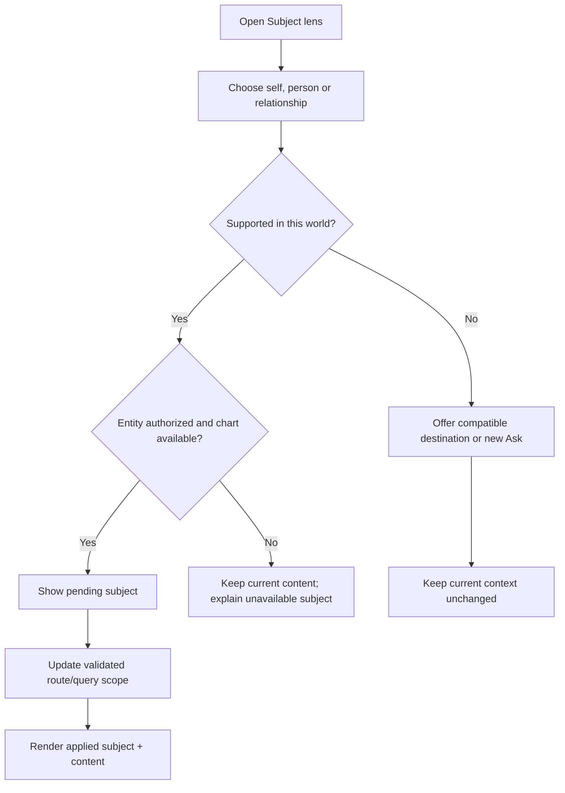
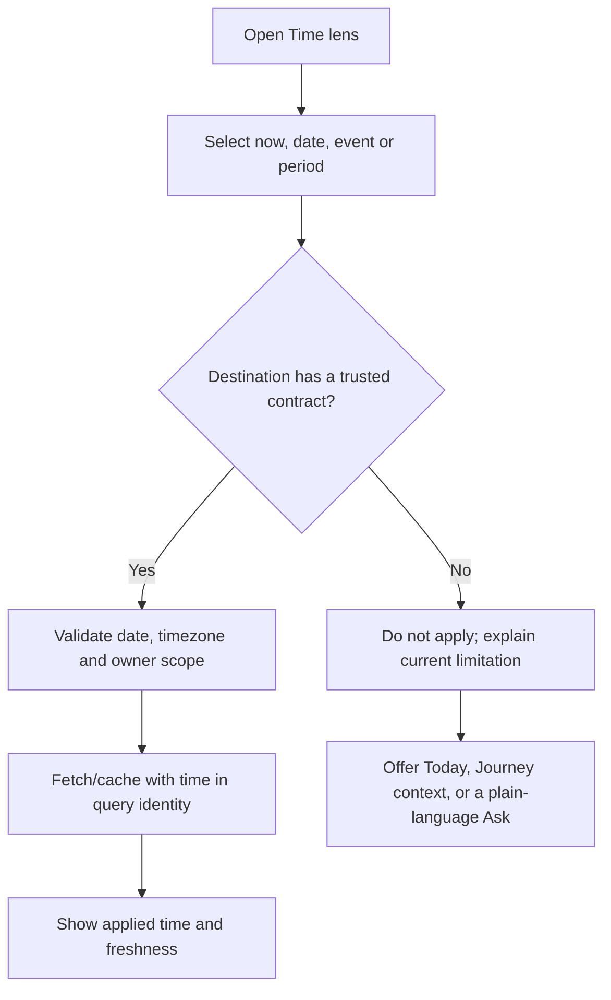

# AstroSaathi 3.0 — Global Context Behavior

**Action:** 1.3 — Define Subject lens, Time lens and Ask-from-anywhere  
**Status:** Approved 8 September 2026  
**Created:** 8 September 2026  
**Type:** UX and integration specification only  
**Implementation authorization:** None  
**Approved information architecture:** Today, My Cosmos, Ask, Journey and Connections  
**Companion documents:** [Future information architecture](./ASTROSAATHI_FUTURE_INFORMATION_ARCHITECTURE.md), [backend contract map](./ASTROSAATHI_FRONTEND_BACKEND_CONTRACT_MAP.md), [design north star](./ASTROSAATHI_COSMIC_ATELIER_NORTH_STAR.md)

---

## 1. Purpose and boundary

This document defines how AstroSaathi communicates three questions everywhere:

1. **Subject lens:** Whose chart or relationship is active?
2. **Time lens:** Which moment, date, event or period is active?
3. **Ask-from-anywhere:** Which evidence should accompany a question to AstroSaathi?

It specifies visible state, inheritance, switching, reset, URL behavior, privacy, failure cases and backend compatibility.

This action does **not**:

- Add an application context store.
- Add route/search parameters.
- Change query keys or cache invalidation.
- Extend `astrologer-chat` request/response payloads.
- Add arbitrary-date transit, horoscope or compatibility calculations.
- Change chat’s current person-focus behavior.
- Attach journal, memory or chart data to a prompt.
- Implement any UI component.

---

## 2. Understanding summary

1. Users must never wonder whether they are viewing themselves, another person or a relationship pair.
2. Users must never mistake “now,” a saved life-event date, a Dasha period or an arbitrary calendar date.
3. Context must be visible and predictable without becoming a risky globally sticky filter.
4. Ask-from-anywhere must prepare a question and evidence preview but never send automatically.
5. The current backend supports self context broadly and a saved-person ID on a chat turn, but it does not expose a general structured time/source envelope.
6. Unsupported subject/time combinations must be disabled or explained, never simulated with generic copy.
7. Context identifiers must remain owner-scoped, privacy-safe and represented in every relevant query/cache boundary.

### Assumptions

- “Global” means a consistent visible language and component model across the app, not that every selection blindly persists across every world.
- Self is the safest default subject.
- “Now” in the user/profile timezone is the safest default time.
- A relationship means the signed-in user plus one saved person under the current compatibility contract.
- A conversation should not silently mix identities or timeframes.
- Existing natural-language chat focus behavior remains valid until a separately approved structured-context contract replaces or augments it.
- Deep links may carry opaque owner-scoped IDs and ISO dates, but never names, birth details, journal text or prompts.

### Non-functional requirements

- **Performance:** context changes cannot clear unrelated world data or refetch every query indiscriminately.
- **Scale:** the model supports the user, saved people and one user–person relationship pair without assuming unlimited arbitrary pairs.
- **Security:** every identifier is re-authorized server-side; no context selector bypasses RLS.
- **Reliability:** the visible context and the data actually used must never diverge.
- **Maintenance:** one versioned context model and one capability matrix govern all screens.
- **Privacy:** sensitive source content is attached only through deliberate user action and clear preview.

---

## 3. Current capability baseline

### 3.1 What exists now

- Most chart/report hooks are implicitly scoped to the signed-in user.
- Person screens use an owner-scoped related-chart route ID.
- Compatibility operates between the signed-in user and a selected eligible saved person.
- Chat accepts `message`, optional `conversation_id`, optional `subject_related_chart_id` and `stream`.
- The current chat route accepts `seed` and `subjectRelatedChartId` search parameters, prefills but does not auto-send, then removes those parameters.
- The saved-person ID scopes only the first explicit turn from that entry path; the backend then uses current/prior user-message name and relation matching for sticky person focus.
- Subject-scoped turns currently use the buffered chat path rather than SSE streaming.
- Today’s transit UI selects “now” from stored transit rows using absolute timestamps and the profile timezone.
- Daily horoscope is generated/cached for the current date, not an arbitrary user-selected date.
- Panchang, market and barometer data are date-indexed in storage, but the public UI reads the latest/current data rather than exposing a general date lens.
- Life events and journal entries own explicit dates and may have stamped astrological context.
- No general frontend/backend `ContextEnvelope` currently exists.

### 3.2 Consequence

The future UI can immediately improve visibility and safe entry behavior, but **global arbitrary subject/date grounding requires staged contract work**. The design must never show a selected lens as active unless the rendered data or submitted chat turn is truly scoped to it.

---

## 4. Context strategies considered

### Approach A — One globally sticky subject and date

Every selection persists across every world until reset.

**Benefit:** feels powerful and continuous.  
**Risk:** many worlds do not support every subject/time combination; users could see self data under another person’s label, and cache/query errors become dangerous.

### Approach B — Visible global model with scoped inheritance — recommended

The same lens components and semantics appear across the application, but context persists only within compatible scopes. On cross-world navigation, context is preserved, transformed or reset according to an explicit capability matrix.

**Benefit:** continuity without false grounding; compatible with incremental backend evolution.  
**Risk:** requires careful transition messaging and typed context projection.

### Approach C — Independent selector on every screen

Each route owns its own person/date controls.

**Benefit:** lowest implementation coupling.  
**Risk:** fragmented mental model, repeated controls and inconsistent chat handoff.

### Decision

Use **Approach B**. Context is globally understandable but locally truthful.

---

## 5. Conceptual context model

This is a design contract, not approved production TypeScript.

```text
AstroContext v1
├── subject
│   ├── self
│   ├── person { relatedChartId }
│   └── relationship { relatedChartId }   // self + selected person
├── time
│   ├── now { timezone }
│   ├── date { isoDate, timezone }
│   ├── event { eventId, isoDate, precision }
│   └── period { system, stablePeriodRef, start, end }
├── source anchors[]
│   └── { kind, stableRef, labelKey, ownerWorld }
└── origin
    └── { world, route, returnTarget }
```

### Core rules

- `self` stores no user ID in the public URL; the session supplies identity.
- A person/relationship stores only an opaque `relatedChartId`.
- A date uses ISO `YYYY-MM-DD` plus an authoritative timezone.
- Event and period references use stable owner-scoped IDs or stable calculated references.
- Source anchors reference trusted stored/calculated artifacts; they do not copy rendered text from the DOM.
- Labels are resolved after authorization and are not trusted from URLs.
- Context has a schema version so future additions do not silently reinterpret old links.

---

## 6. Authority and state ownership

Context has four possible authorities. Higher rows win when they conflict.

| Priority | Authority | Purpose |
|---:|---|---|
| 1 | Authorized route/entity | Person ID, event ID, conversation ID and canonical deep link |
| 2 | Backend conversation/artifact metadata | Context actually used to produce stored output |
| 3 | Explicit unsent UI selection | Proposed context shown in composer/lens preview |
| 4 | Session default | Self + now in profile timezone |

### Truthfulness rule

The UI must visually distinguish:

- **Applied context:** verified and used by the rendered result.
- **Pending context:** selected but not yet sent/applied.
- **Unavailable context:** requested but not supported or could not be authorized.

Never display pending context as if it grounded an existing result.

### URL vs session state

- Shareable identity/date/entity context belongs in validated route/search state.
- Temporary UI such as an open lens menu belongs in component state.
- Safe last-used context may be remembered per world for the current session.
- Sensitive prompt/source text never belongs in the URL.
- Conversation-applied context belongs with conversation/message metadata when the backend eventually supports it.

---

## 7. Subject lens

## 7.1 Subject types

| Subject | Visible label pattern | Source of truth |
|---|---|---|
| Self | “My chart” plus avatar/glyph | authenticated user and birth profile |
| Saved person | person name plus relation | owner-scoped `related_charts` row |
| Relationship | “Me + {person}” | self plus eligible related-chart ID |

No generic “Person 1/Person 2” label is permitted once identity resolves.

## 7.2 Placement

- Desktop/tablet: compact lens control in the world’s contextual top bar.
- Mobile: compact chip/button beneath or beside the world title; opens a bottom sheet.
- Ask: a context capsule immediately above/inside the composer so the subject is visible before sending.
- Person/compatibility routes: subject is also reinforced in the page title; the lens cannot be the only identity cue.

## 7.3 Subject menu

The sheet/popover contains:

1. My chart.
2. Saved people grouped or listed with relationship labels.
3. Relationship choices only where supported.
4. “Add person” link to Connections.

The menu does not expose birth dates, locations or other sensitive data.

## 7.4 Switching sequence



### Non-negotiable transition rule

Do not change the visible label first and reuse old data underneath it. Keep the current applied view until the new subject’s authorized data is ready, or show an explicit loading boundary that includes the new pending identity.

## 7.5 Subject persistence

- My Cosmos may remember the last subject during the current session.
- Connections derives subject from its route and selected record.
- Ask stores subject per conversation/turn when supported; switching explicitly should start a new conversation by default.
- Today and Journey default to self because their current contracts are self-owned.
- Profile/Settings always refers to the signed-in user and does not accept a person subject.
- Sign-out clears all remembered subject state and protected query data.

## 7.6 Deletion and invalidation

If a saved person is deleted:

- Active person/relationship routes leave the deleted subject safely and return to Connections.
- The lens removes the person immediately after confirmed deletion.
- Historical conversations remain, but any missing subject is labeled “Saved person no longer available”; never fall back silently to self.
- Query/cache entries scoped to that ID are removed without clearing unrelated self data.

---

## 8. Subject capability matrix

| World/surface | Self | Saved person | Relationship | Current backend status |
|---|---:|---:|---:|---|
| Today | Yes | Future/unsupported | Future/unsupported | self + now only |
| My Cosmos overview | Yes | Possible through person chart contract | No | separate self/person query contracts |
| Kundali/Vargas | Yes | Yes | No | supported through separate endpoints |
| Dashas/doshas/remedies/Ashtakavarga | Yes | Limited/not uniformly exposed for person | No | must be capability-checked |
| Ask | Yes | Yes for explicit focus | Natural-language/compatibility-assisted only | no durable structured subject metadata returned |
| Journey | Yes | No | No | user-owned life/journal tables |
| Connections list/person | Self anchor | Yes | No | supported |
| Compatibility | Self implicit | selected person | Yes, self + person | supported |
| Settings/Profile | Yes | No | No | authenticated account only |

Controls must be generated from this matrix. A disabled/absent option is safer than a visually active but ungrounded mode.

---

## 9. Time lens

## 9.1 Time modes

| Mode | Meaning | Example use |
|---|---|---|
| Now | Current instant/day in authoritative timezone | Today transits, current Dasha |
| Date | One explicit calendar day | future/past transit only after backend support |
| Event | Saved life-event or journal date with precision | inspect stamped context, ask about that moment |
| Period | Calculated Dasha/sub-period range | explore a life chapter |

“Birth” is not a time-lens mode; it is the basis of the natal chart.

## 9.2 Timezone authority

Order of authority:

1. Stored profile timezone where the contract uses it.
2. Birth timezone for natal/time calculations requiring birth context.
3. Explicit function-returned timezone.
4. `Asia/Kolkata` only where that is the current documented fallback.

The browser’s local timezone must not silently override a stored calculation timezone.

## 9.3 Placement

- Today: date/time control near the world title; initially fixed to Today if no arbitrary-date contract exists.
- My Cosmos Timing: period selector local to Dasha/timeline content.
- Journey: event/date is part of the selected record and may project into a time lens.
- Ask: time capsule in the composer when an explicit date/event/period is attached.
- Connections: hidden unless a future compatibility-timing feature is explicitly supported.

## 9.4 Switching sequence



## 9.5 Date precision

- Exact event date: show day, month and year.
- Month precision: never render an invented day.
- Year precision: never render an invented month/day.
- Approximate: label visibly and carry precision into Ask context.
- A period shows start/end and current position when supported.

## 9.6 Reset rules

- “Back to now” returns to the authoritative current date/timezone.
- Leaving a saved event detail removes event scope unless an explicit cross-world action carries it.
- Entering Today without a supported date deep link resets to now.
- Starting a new unscoped Ask defaults to now.
- Reset never modifies stored life-event/journal dates.

---

## 10. Time capability matrix

| Surface | Now | Arbitrary date | Event | Dasha period | Current status |
|---|---:|---:|---:|---:|---|
| Today transits | Yes | No UI/general fetch contract | No | No | now-bound |
| Daily horoscope | Yes/current date | No | No | No | current-date function |
| Panchang | Current/latest UI | Compute supports date operationally, UI/query does not | No | No | not a user lens yet |
| Markets | Latest stored date | Historical rows exist for some modules | No | No | not one unified date contract |
| My Cosmos natal | Not time-dependent | Not applicable | Not applicable | No | birth chart |
| Dasha timeline | Current + ranges | Date lookup may be derivable but needs contract | Event can reference stamped Dasha | Yes | period data exists |
| Journey | Current overview | Record date | Yes | stamped/current context | supported per record |
| Ask | Current context | Natural-language only | Data may be in memory/context, not explicit request envelope | Natural-language only | structured time unsupported |
| Compatibility | Timeless natal pair | No | No | No | current bundle |

An enabled date picker is forbidden until every module behind it can truthfully honor the same date or clearly declares its own date coverage.

---

## 11. Context projection across worlds

When the user follows a cross-world action, the source context is projected into the destination.

| Source context | Destination | Projection |
|---|---|---|
| Self + now | Any compatible world | preserve |
| Person | Person Cosmos | preserve person |
| Person | Ask | create new person-scoped Ask; current bridge can send saved-person ID on first turn |
| Relationship | Ask | create new Ask with explicit pair label; structured relationship grounding requires contract verification |
| Event/date | Ask | show pending time/source capsule; do not claim backend grounding until supported |
| Event/date | My Cosmos Timing | focus matching period only if a verified lookup exists |
| Dasha period | Journey | filter/highlight events in range only if client data supports it |
| Unsupported person/date | Today | reset to self + now with explicit “Today currently uses your chart” notice |

### Projection outcomes

- **Preserve:** destination supports the exact context.
- **Transform:** event becomes its recorded date or relationship becomes selected person where meaning remains explicit.
- **Prompt:** ask the user before losing material context.
- **Reset with notice:** destination cannot support it safely.
- **Block:** authorization or required data is missing.

No silent transformation is allowed when it changes whose chart or which date is being interpreted.

---

## 12. Ask-from-anywhere

## 12.1 Purpose

Ask-from-anywhere turns a screen object into a prepared conversation without forcing the user to restate context. It does not bypass confirmation or create a magical uninspectable prompt.

## 12.2 Entry points

Eligible sources include:

- Planet, sign, house, Nakshatra or chart view.
- Dasha, Antardasha or Pratyantardasha period.
- Dosha result or valid-negative state.
- Remedy/mantra.
- Ashtakavarga summary or selected technical cell/group where a stable reference exists.
- Today transit, Panchang element or horoscope section.
- Market signal with mandatory financial framing.
- Life event or journal entry through deliberate user action.
- Saved person, compatibility section or relationship result.
- Proactive nudge.

Not every decorative element needs an Ask button. Use one contextual action at the section/object level.

## 12.3 Interaction flow

```mermaid
sequenceDiagram
    participant U as User
    participant S as Source screen
    participant C as Context preview
    participant A as Ask composer
    participant B as Existing/Future backend

    U->>S: Choose “Ask about this”
    S->>C: Resolve authorized subject, time and source reference
    C-->>U: Show what will be attached
    U->>C: Keep/remove anchors and continue
    C->>A: Open new draft; never auto-send
    A-->>U: Show pending context capsules + editable question
    U->>A: Send
    A->>B: Submit supported context only
    B-->>A: Return answer + applied provenance when supported
    A-->>U: Distinguish applied context from unsupported/omitted context
```

## 12.4 Context preview

The preview answers:

- **About:** My chart, person name, or Me + person.
- **When:** Now, exact/approximate date, event or period.
- **From:** e.g. “Moon transit,” “Venus Mahadasha,” “Compatibility — Guna Milan.”
- **Included:** only the reference/authorized evidence intended for the backend.
- **Not included:** unrelated journal/history/memory content.

The user can remove optional source anchors before opening Ask. Subject cannot be removed when the source is a person/relationship object; it can be changed only through an explicit new context choice.

## 12.5 Composer behavior

- Prefill a concise editable question, never an answer.
- Do not auto-send.
- Show context capsules above the draft.
- Pending capsules use a distinct visual treatment from applied provenance on existing answers.
- Closing Ask without sending returns to the source screen and does not create an empty conversation where avoidable.
- Sending creates/resumes a conversation only according to existing safe lifecycle rules.

## 12.6 Sensitive sources

### Journal

- Never attach an entry merely because it is visible.
- “Ask about this reflection” is an explicit action.
- Preview the entry title/date and a clear content-inclusion statement.
- Do not put entry text in route/search parameters.

### Life events

- Attach stable event ID and date/precision when supported.
- Do not expose private event descriptions in URLs or analytics.

### Memory

- Respect memory opt-in/exclusion/retention.
- An Ask action cannot silently override a memory exclusion.

### Market material

- Label the context as market/financial astrology.
- Preserve the current disclaimer in the source and answer experience.

---

## 13. Compatibility with the current chat contract

### Safe immediately using existing behavior

- Open a new self-scoped Ask with `seed`.
- Open a saved-person Ask with `seed` + `subjectRelatedChartId`.
- Keep the question editable and require Send.
- Preserve current conversation ID, streaming/fallback, persistence and feedback behavior.

### Not safe to claim without contract extension

- Durable subject metadata for every stored conversation/message.
- A structured relationship-pair parameter.
- A structured date/event/Dasha-period parameter.
- Stable source-artifact provenance supplied by the caller and confirmed by the server.
- Backend acknowledgement of which requested context it accepted/omitted.
- Subject-scoped SSE parity, because current explicit subject turns skip SSE.

### Required future versioned extension

If separately approved, chat should accept a server-validated context envelope and return applied-context metadata. The server must derive authoritative facts from IDs, not trust chart text supplied by the browser.

Conceptual request addition:

```text
context: {
  version,
  subject_ref?,
  relationship_ref?,
  time_ref?,
  source_refs[]
}
```

Conceptual response/metadata addition:

```text
applied_context: {
  accepted_refs[],
  omitted_refs[] with reasons,
  resolved_subject,
  resolved_time,
  provenance_version
}
```

This would be a logic/integration change requiring explicit authorization, tests and version fallback. It is **not** authorized by this document.

---

## 14. Conversation rules

### New conversation

- Uses explicit pending subject/time/source if present.
- Otherwise defaults to self + now.
- A `seed` or subject entry path must not resume a stale conversation; current behavior already enforces this.

### Resume conversation

- Restores the last server-confirmed conversation context where metadata exists.
- Until structured metadata exists, do not invent a context badge from the title alone.

### Explicit subject switch

Recommended default: offer **“Start a new conversation about {subject}”**. This protects identity separation and makes history easier to understand.

If the user changes subject naturally inside message text, preserve existing backend behavior. The UI cannot reliably update an applied subject badge until the backend returns resolved-focus metadata.

### Explicit time switch

- A new explicit date/event/period should start a new conversation by default.
- Natural-language date discussion remains possible, but it is not equivalent to structured calculated time context.

### Mixed comparison

- Relationship/comparison mode must explicitly show both identities.
- Do not merge chart placements into one unlabeled fact set.
- If one chart is unavailable, say which one and avoid partial comparison claims that imply completeness.

---

## 15. Visual behavior within Cosmic Atelier

### Subject lens

- Self: Solar saffron marker.
- Saved person: one stable secondary hue chosen from an accessible subject palette.
- Relationship: two markers connected by a shared field; never colour alone.
- Pending state: soft moving edge or dotted orbit.
- Applied state: stable solid edge/check label.
- Unavailable state: neutral broken orbit plus explanatory text, not a destructive red alarm.

### Time lens

- Now: a bright current-position marker.
- Past: Lunar trail.
- Future/possible: Aurora path with explicit “future” label; never visually present as certainty.
- Event: anchored point with precision label.
- Period: bounded arc/range.

### Ask context

- Pending context capsules use restrained Aurora glass.
- Applied evidence/provenance uses solid Prism precision surfaces.
- Long content remains on solid Midnight/Dawn reading surfaces.
- Reduced-motion mode replaces orbit/morph transitions with immediate state and text changes.

---

## 16. Loading, failure and conflict states

| Situation | Required behavior |
|---|---|
| Subject loading | show pending identity in loading boundary; keep old applied data clearly separate or removed |
| Person unauthorized/not found | keep current safe context; explain and offer Connections |
| Person chart not generated | identify the person; offer chart-generation route; do not guess |
| Time unsupported | keep prior applied time; explain limitation; do not enable false filter |
| Date outside available data | show unavailable range/freshness, not empty “no influence” |
| Source artifact stale | re-resolve server-side or mark omitted; do not trust cached rendered text |
| Partial source acceptance | answer may continue only with visible omitted-context notice |
| Context conflicts with route | authorized route entity wins; ask before material reset |
| Deleted event/person | label unavailable; never fall back silently to self/now |
| Offline | preserve verified cached context with freshness; block unsupported mutation/send gracefully |
| Sign-out/session expiry | clear protected context and queries before public shell renders |

---

## 17. Cache and query identity requirements

Any future implementation must include every material context dimension in the relevant query key:

```text
[domain, authenticatedUserId, subjectKind, subjectRef, timeMode, timeRef, locale, ...reportInputs]
```

Rules:

- Never reuse self data for a person key or one person’s data for another.
- Never reuse current-date results under a historical/future label.
- Locale belongs in generated-language result keys where output is localized.
- Subject deletion removes only keys referencing that person.
- Birth-profile changes invalidate self-derived artifacts and any relationship outputs depending on self.
- Related-person birth changes invalidate that person plus dependent compatibility outputs.
- Timezone changes invalidate current-time presentation/queries where dates can cross boundaries.
- Context UI state is not itself a server cache key until it is applied.

Existing query-key irregularities documented in Action 0.4 must be reconciled before relying on broad context invalidation.

---

## 18. Privacy and security rules

- Never place names, birth dates, birth locations, journal content, prompts or chart JSON in URLs.
- Treat route IDs as untrusted until RLS/server authorization succeeds.
- The browser cannot declare authoritative planetary facts in a context payload.
- The server re-resolves person, event, period and artifact references for the authenticated user.
- Context previews reveal only what will be used, not hidden memory data.
- Analytics may record context kind and source kind, never person identity, prompt text or journal/event content.
- Clipboard/share actions default to excluding private context metadata unless the user explicitly includes it.
- Screenshot/share affordances must warn when a saved person’s information is visible.
- Sign-out clears persisted query cache and transient context.
- Account deletion wording must continue to state the action’s real backend effect.

---

## 19. Accessibility and localization

- Lens controls are real buttons with visible text and an accessible expanded state.
- Context changes announce one concise polite message: “Showing Priya’s chart,” “Showing 12 March 2024,” etc.
- Applied, pending and unavailable context use text plus shape/status—not colour alone.
- Bottom sheets/popovers return focus to the triggering lens.
- Person names support truncation visually while full names remain accessible.
- Hindi/Marathi context labels use grammatical native-language review; do not concatenate translated fragments mechanically.
- Dates use localized display but retain ISO values internally.
- Approximate/month/year precision survives localization.
- Context capsules wrap at 320 px and 200% text size.
- Removing a capsule has an explicit label such as “Remove Moon-transit context.”
- Motion is never required to understand a switch.

---

## 20. Validation matrix for future implementation

### Subject

- Self → person → self with no stale-data flash.
- Person A → Person B with isolated caches.
- Person → relationship with both identities explicit.
- Unauthorized/deleted/ungenerated person.
- Person edit invalidates correct derived results.
- Sign-out clears subject and protected content.

### Time

- Now across timezone/date boundary.
- Exact/month/year/approximate event precision.
- Current Dasha period and boundary transition.
- Unsupported date selector remains disabled/explained.
- Stale current-day cache cannot appear as a selected future/past day.

### Ask

- Self source with editable seed and no auto-send.
- Saved-person source using current buffered behavior.
- Conversation lifecycle with/without seed.
- Source removal before send.
- Sensitive journal confirmation.
- Backend accepts all, some or none of a future envelope.
- Streaming and buffered responses expose identical applied-context semantics when parity is added.
- Browser refresh and Back preserve/clear draft context predictably.

### Accessibility/localization

- Keyboard-only subject/time selection.
- Screen-reader announcements and focus return.
- English/Hindi/Marathi at 320 px and 200% text.
- Reduced motion/transparency and increased contrast.

---

## 21. Acceptance checklist

Action 1.3 can be approved when the user agrees that:

- Global context is consistent but scoped—not blindly sticky.
- Self + now is the safe default.
- Today and Journey remain self-only until real saved-person contracts exist.
- Unsupported date/subject choices are unavailable rather than simulated.
- Explicit subject or material time changes start a new Ask by default.
- Ask-from-anywhere always previews context and never auto-sends.
- Journal/event content receives explicit privacy treatment.
- Current `seed` + saved-person behavior is preserved as the initial compatibility bridge.
- Structured subject/time/source grounding requires a separately approved backend version extension.
- Visible applied context must match server-authorized context exactly.

---

## 22. Decision log

| Decision | Alternatives | Reason |
|---|---|---|
| Use scoped inheritance | Globally sticky; per-screen isolated selectors | Preserves continuity without false grounding. |
| Default to self + now | Restore arbitrary last context globally | Safest and matches current contracts. |
| Route/backend metadata outranks UI selection | UI chip as source of truth | Prevents labels diverging from data actually used. |
| Keep subject/date capability-aware | Show all options everywhere | Unsupported context must not appear functional. |
| Start a new Ask for explicit subject/time change | Mutate active conversation silently | Protects identity/time clarity and conversation history. |
| Preserve natural-language focus switching | Forbid it immediately | Existing backend supports it; replacement requires response metadata. |
| Preview and confirm Ask context | Auto-send from source | Supports user agency and privacy. |
| Reference trusted artifacts by ID | Copy rendered text/chart JSON into prompt | Server can authorize and resolve canonical facts. |
| Keep sensitive text out of URLs | Encode full draft/context in query string | Protects privacy, logs and sharing. |
| Require time in query identity | Reuse current cache | Prevents present data appearing under another date. |
| Separate pending from applied context | One visual chip state | Makes backend omissions/failures honest. |
| Treat future chat envelope as separate authorization | Assume current payload can carry it | It changes backend contract and needs versioned tests. |

---

## 23. Approval record

The user approved the complete context model, capability limits and Ask handoff behavior on 8 September 2026.

Action 1.3 is complete. The approval authorizes subsequent design-specification actions one at a time; it does not authorize frontend state, route, query, database or Edge Function changes.
